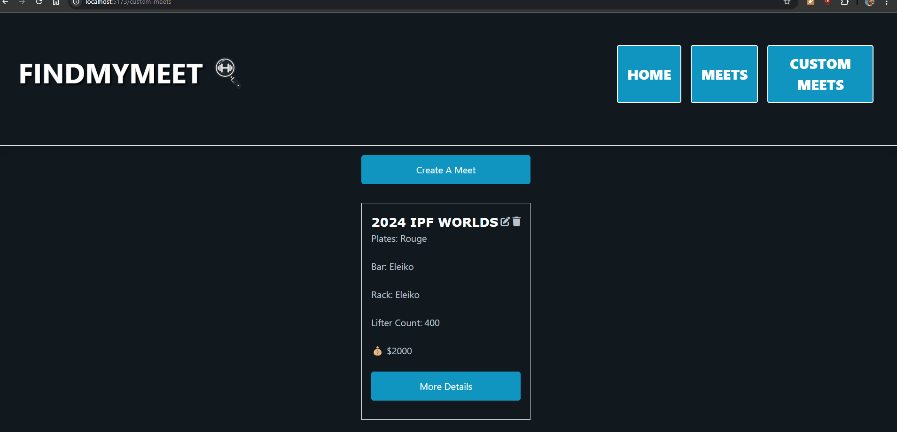

# WEB103 Project 4 - *FindMyMeet*

Submitted by: **Jason Tang**

About this web app: **Helps lifters find their next powerlifting meet while also allowing them to create their own**

Time spent: **12-15** hours

## Required Features

The following **required** functionality is completed:

<!-- Make sure to check off completed functionality below -->
- [X] **The web app is connected to a PostgreSQL database, with an appropriately structured `CustomCar` table**
  - [X] **NOTE: Your GIF must include a view of your Railway database that shows the contents of the table used by your app**
- [X] **The web app uses React to display data from the API**
- [X] **Users can view a list of options they can select for different aspects of a `CustomCar`**
- [X] **On selecting each option, the displayed visual icon for the `CustomCar` updates to match the option the user chose**
- [X] **The user can submit their choices to save the car to the list of created `CustomCar`**
- [X] **If a user submits a feature combo that is impossible, they should receive an appropriate error message and the item should not be saved to the database**
- [X] **The app displays the total price of all features**
- [X] **Users can view a list of all submitted `CustomCar`**
- [X] **Users can edit or delete a submitted `CustomCar` from the list view of submitted `CustomCar`**
- [X] **Users can update or delete `CustomCar` that have been created from the detail page**

The following **optional** features are implemented:

- [X] Selecting particular options prevents incompatible options from being selected even before form submission

The following **additional** features are implemented:

- [ ] List anything else that you added to improve the site's functionality!

## Video Walkthrough

Here's a walkthrough of implemented required features:

<!-- Replace this with whatever GIF tool you used! -->
GIF created with ScreenToGif
<!-- Recommended tools:
[Kap](https://getkap.co/) for macOS
[ScreenToGif](https://www.screentogif.com/) for Windows
[peek](https://github.com/phw/peek) for Linux. -->

## Notes

This is a continuation of the Unit 3 Project, which adds the functionality to create custom meets that you can view, edit, and delete from the database. 
- Styled with TailwindCSS
- Stack: PostgreSQL, Express, React, Node

## License

Copyright [2024] [Jason Tang]

Licensed under the Apache License, Version 2.0 (the "License"); you may not use this file except in compliance with the License. You may obtain a copy of the License at

> http://www.apache.org/licenses/LICENSE-2.0

Unless required by applicable law or agreed to in writing, software distributed under the License is distributed on an "AS IS" BASIS, WITHOUT WARRANTIES OR CONDITIONS OF ANY KIND, either express or implied. See the License for the specific language governing permissions and limitations under the License.

# WEB103 Project 3 - *FindMyMeet*

Submitted by: **Jason Tang**

About this web app: **App description here**

Time spent: **15** hours

## Required Features

The following **required** functionality is completed:

<!-- Make sure to check off completed functionality below -->

- [X] **The web app uses React to display data from the API**
- [X] **The web app is connected to a PostgreSQL database, with an appropriately structured Events table**
  - [X] **NOTE: Your GIF or a screenshot added to this README must include a view of your Railway database that shows the contents of the table used by your app**
- [X] **The web app displays the title of the app**
- [X] **A visual interface allows the user to select a Location they would like to view**
- [X] **Clicking on a Location shows a list of all items from the Events table that corresponds to that Location**
- [X] **Each Location detail page should have its own unique URL**

The following **optional** features are implemented:

- [ ] An additional page shows all possible `Events` that the user can sort and filter by `Location`
- [ ] `Events` display a countdown showing the time remaining before that event and appears with different formatting when the event has passed

The following **additional** features are implemented:

- [ ] List anything else that you added to improve the site's functionality!

## Video Walkthrough

Here's a walkthrough of implemented required features:

<!-- Replace this with whatever GIF tool you used! -->
GIF created with ScreenToGif
<!-- Recommended tools:
[Kap](https://getkap.co/) for macOS
[ScreenToGif](https://www.screentogif.com/) for Windows
[peek](https://github.com/phw/peek) for Linux. -->

## Notes

Describe any challenges encountered while building the app or any additional context you'd like to add.

## License

Copyright [2024] [Jason Tang]

Licensed under the Apache License, Version 2.0 (the "License"); you may not use this file except in compliance with the License. You may obtain a copy of the License at

> http://www.apache.org/licenses/LICENSE-2.0

Unless required by applicable law or agreed to in writing, software distributed under the License is distributed on an "AS IS" BASIS, WITHOUT WARRANTIES OR CONDITIONS OF ANY KIND, either express or implied. See the License for the specific language governing permissions and limitations under the License.